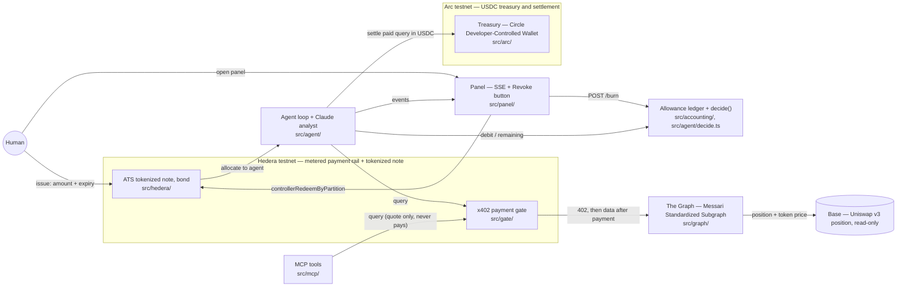

# Allowance

**An agent shouldn't hold keys. It should get an allowance.**

- An AI agent watches a real Uniswap v3 position on Base and warns if it deteriorates.
- Every data query costs money and is paid per request, through an on-chain payment gate — there
  is no free tier, not even in the demo.
- The agent spends from a bounded, expiring, revocable allowance and stops by itself when it runs
  out; a human can also revoke it at any time, on-chain.

## Architecture



Full write-up, with one paragraph per component and its source directory: [docs/architecture.md](docs/architecture.md).

## How it works — the payment flow

1. **Issue** — the human creates an allowance note (amount in microUSDC, expiry) and, if the
   Hedera credentials are configured, tokenizes it as a bond through Asset Tokenization Studio
   and allocates it to the agent (`src/hedera/ats.ts`, `issueNoteOnChain`).
2. **Query** — the agent's deterministic rule, `decide()`, checks whether a data query is worth
   its price given the note's remaining budget and how stale the cached answer is
   (`src/agent/decide.ts`). If it decides to pay, it calls the x402 gate.
3. **402** — the gate responds `402 Payment Required` with the price, using the official
   `@x402/hono` middleware (`src/gate/routes.ts`, `src/gate/server.ts`).
4. **Pay via Blocky402** — the agent signs and sends a real USDC payment on Hedera testnet and
   retries; the payment is verified and settled through the **Blocky402 facilitator**
   (`https://api.testnet.blocky402.com`) (`src/gate/pay.ts`).
5. **Data** — once paid, the gate serves the query result from a Messari Standardized Subgraph on
   The Graph (`src/graph/client.ts`).
6. **Settle on Arc** — the agent settles that same paid query in USDC on Arc testnet, from a
   Circle Developer-Controlled Wallet, with an idempotency key derived from the payment so a
   retry never pays twice (`src/arc/treasury.ts`).
7. **Stop or revoke** — the agent checks the debit before paying and commits it only once the
   payment succeeded, for every query (`src/agent/run.ts`), and stops itself the instant the note
   is exhausted or expired. A human can also revoke it at any moment from the panel: the ledger is
   burned immediately and, if the note was issued on-chain, `controllerRedeemByPartition` burns
   the unspent balance on Hedera too (`src/panel/server.ts`, `src/hedera/ats.ts`).

## Two rails, one payment

Steps 4 and 6 above both move USDC, on two different chains, and that can look like the agent
"pays twice" for one query. It doesn't — they're two legs of the same payment:

- **The data vendor is paid once, on Hedera** — from the agent's own float (its Hedera USDC
  balance), capped by the allowance. This is the x402 payment (`src/gate/pay.ts`).
- **The treasury pays once, on Arc** — reimbursing whoever owns that float
  (`ARC_OPERATOR_ADDRESS`), keyed by the Hedera payment's transaction id so a retry can never
  reimburse the same payment twice (`src/arc/treasury.ts`, `idempotencyKeyFromRef`).

In this demo every account involved belongs to us, so both HashScan and Arcscan show the same
amount moving — that can look redundant, but the Arc leg is a **reimbursement of the float**, not
a second purchase. In production the float owner and the data vendor would typically be different
parties, and the Arc settlement is what makes fronting the Hedera payment sustainable for whoever
holds that float.

## Setup

### Prerequisites

- Node.js 20 or newer (built and tested on Node 22).
- A The Graph API key, to query the Messari Standardized Subgraph.
- Hedera testnet accounts — note these are not the same account:
  - **The paying agent account** (`HEDERA_ACCOUNT_ID` / `HEDERA_PRIVATE_KEY`) needs USDC token
    `0.0.429274` and must be **associated** with it (HBAR for fees is covered by the Blocky402
    facilitator, which pays the fee as fee payer) — this is the account that pays the x402 gate.
  - **The ATS issuer account** (`ATS_ISSUER_PRIVATE_KEY`) needs HBAR, to sign and pay gas for
    deploying the bond, issuing it to the agent, and burning it on revoke — it never touches
    USDC.
  - **The gate's pay-to account** (`GATE_PAYTO_ACCOUNT_ID`) must also be associated with USDC
    `0.0.429274`, or it cannot receive the payment.
- A Circle Developer-Controlled Wallet on Arc testnet, to settle paid queries in USDC.
- An Anthropic API key, for the Claude analyst (optional — the agent still spends and stops
  correctly without it; it just stops producing alerts).

### Configure

```bash
cp .env.example .env
```

`.env.example` is already complete and secret-free — every variable read anywhere in `src/` is
listed there. Fill in only what the feature you want to run needs:

| Runs with... | Needs |
|---|---|
| `npm run gate` (`src/gate/server.ts`) | `GRAPH_API_KEY`, `GRAPH_SUBGRAPH_URL` (serves the tool data), `GATE_PAYTO_ACCOUNT_ID` (who gets paid), `X402_FACILITATOR_URL` (Blocky402, already defaulted in `.env.example`) |
| `npm run mcp` (`src/mcp/server.ts`) | `GATE_URL` (where the gate it calls is listening) |
| `npm run agent` (`src/agent/main.ts`) — paying the gate | `GATE_URL`, `HEDERA_ACCOUNT_ID`, `HEDERA_PRIVATE_KEY` |
| `npm run agent` — settling on Arc | `ARC_OPERATOR_ADDRESS`, `CIRCLE_API_KEY`, `CIRCLE_ENTITY_SECRET`, `CIRCLE_WALLET_ID`, `ARC_CHAIN_ID`, `ARC_RPC_URL` |
| `npm run agent` — the note and what it watches | `ALLOWANCE_AMOUNT_MICRO_USDC`, `ALLOWANCE_TTL_MS`, `WATCH_POSITION_ID`, `WATCH_TOKEN_CONTRACT`, `PANEL_PORT` |
| `npm run agent` — Claude analyst (optional) | `ANTHROPIC_API_KEY` — without it the agent still spends and stops correctly, it just stops producing alerts |
| `npm run agent` — tokenize the note in ATS (optional) | `ATS_ISSUER_PRIVATE_KEY`, `HEDERA_EVM_ADDRESS`, `ATS_FACTORY_ID`, `ATS_RESOLVER_ID`, `HEDERA_RPC_RELAY` — if `ATS_ISSUER_PRIVATE_KEY` or `HEDERA_EVM_ADDRESS` is absent, the agent still runs, with the note kept in memory only |

`CIRCLE_WALLET_ADDRESS` is not read by any of the above — it is the treasury's own address, kept
in `.env.example` for looking the wallet up on Arcscan.

None of this is required to install the project or run its tests: every test is self-contained
and network-free, setting and restoring any environment variable it needs.

### Install and test

```bash
npm install
npm test
```

## How to run

```bash
npm run typecheck   # tsc --noEmit
npm run gate         # x402 payment gate         — src/gate/server.ts
npm run mcp          # priced tools over MCP      — src/mcp/server.ts
npm run agent        # the agent loop + panel     — src/agent/main.ts
```

Each of these scripts (`agent`, `gate`, `mcp`) runs `tsx --env-file=.env`, so `.env` is loaded
automatically before any code runs — no separate `dotenv` step needed.

`npm run agent` starts the panel (default `http://127.0.0.1:8787`, bound to loopback only — not
reachable from other machines) and the spending loop together; point it at the gate with
`GATE_URL`.

## Prize map

| Track | Requirement | Files |
|---|---|---|
| The Graph — Best Use of Composable or Standardized Graph Products | Build meaningfully on a standardized schema | `src/graph/client.ts` (Messari Standardized Subgraph, DEX AMM Extended schema, Uniswap v3 on Base — one query shape for position state and token price), `src/graph/tools.ts` |
| The Graph — Best AI Tooling or AI Use Case | Graph data is load-bearing for agent reasoning and decisions, exposed as AI tooling | `src/graph/tools.ts` (priced tools), `src/agent/decide.ts` (spending decision on Graph data freshness), `src/agent/analyst.ts` + `src/agent/run.ts` (Claude reasons over paid Graph facts), `src/mcp/server.ts` (the same priced tools exposed over MCP — quote only, it never pays) |
| Hedera — AI & Agentic Payments | An x402 service, an agent that consumes it, and settlement through a facilitator | `src/gate/server.ts`, `src/gate/routes.ts` (x402 service on `@x402/hono`), `src/gate/pay.ts` + `src/agent/live.ts` (consuming agent), settled through the **Blocky402 facilitator** (`https://api.testnet.blocky402.com`) |
| Hedera — Tokenization of Anything | A tokenized instrument with a real lifecycle: issue and burn | `src/hedera/ats.ts` (Asset Tokenization Studio contracts, factory `0.0.9213391`, resolver `0.0.9212226`; `issueNoteOnChain` issues the bond, `burnNoteOnChain` calls `controllerRedeemByPartition` to revoke) |
| Arc — Best Agentic Economy Application with Circle Agent Stack | Effective use of Circle's developer tools for an agent's payments | `src/arc/treasury.ts` (Circle Developer-Controlled Wallet, `@circle-fin/developer-controlled-wallets`), `src/arc/amount.ts` |
| Arc — Best DeFi/Onchain Finance Application | On-chain USDC settlement with a documented architecture | `src/arc/treasury.ts` (USDC settlement, idempotency key derived from the payment), [docs/architecture.md](docs/architecture.md) (required diagram) |

## On-chain evidence

No real transaction exists yet — the Hedera and Arc testnet accounts used for the demo are not
funded at the time of writing. Each row below will be filled in with a real explorer link after
the funded run; nothing here is simulated or fabricated in advance.

| Proof | Explorer | Link |
|---|---|---|
| ATS bond deployment (`deployBond`) | HashScan testnet | [deployBond](https://hashscan.io/testnet/transaction/0x3020f40e93ece3dbd3aba7ae5d149e422060db4ae0bd2c8a0822d11f51697f13) → [bond contract](https://hashscan.io/testnet/contract/0x595e5f93d1e48f822AC5bDB9F14AB4A2FCf8d365) |
| ATS issue to the agent (`issue`) | HashScan testnet | [issue to the agent](https://hashscan.io/testnet/transaction/0xac81cd9ccf2aca4b61f65d39feddb385baffbd410a20138acd08dee75e35df7b) |
| x402 payment settled by Blocky402 (fee payer `0.0.7162784`) | HashScan testnet | <!-- PENDING-TX: x402-payment --> |
| Arc settlement from the Circle wallet | Arcscan testnet | [USDC settlement from the Circle wallet](https://testnet.arcscan.app/tx/0x4bb300a6a94d6db9e1e90f7a0531065d44b4d78f0cfac52c2e88c481ff4e25bb) |
| ATS burn on revoke (`controllerRedeemByPartition`) | HashScan testnet | [controllerRedeemByPartition burn](https://hashscan.io/testnet/transaction/0xcff2ceebe895b88eff909bdcdf1017913f173bc8e9f44751ba6ac141cf2635ef) |

## Limitations

- **Testnet only.** Everything above runs on Hedera testnet and Arc testnet. Arc mainnet does not
  exist yet, so there is no mainnet path to describe or test.
- **Per-query spend is tracked off-chain.** The ATS bond represents the authorization that was
  issued, not a live on-chain counter of what has been spent so far — the ledger in
  `src/accounting/` tracks that. A revoke burns whatever is left unspent at that moment; natural
  exhaustion (the note running to zero on its own) does not trigger an on-chain burn, because
  nothing needs revoking that hasn't already stopped the agent off-chain.
- **The Messari Standardized Subgraph does not fill `liquidityUSD` for Uniswap v3 positions** (it reads `0`), and its largest pools by reported TVL are spam with nonsensical figures. The agent therefore reasons with raw `liquidity` and the token USD prices, and the demo watches an open position in the WETH/USDC 0.05% pool on Base (`0xd0b53d9277642d899df5c87a3966a349a798f224`).
- **The Claude analyst is optional and advisory only.** It never decides to spend — `decide()`
  does, always — and if it refuses or fails, the agent keeps paying and stopping exactly as it
  would otherwise.
- **Prototype trust boundary.** In this prototype the settlement leg (Circle credentials,
  `src/arc/treasury.ts`) and the issue/burn leg (the ATS issuer key, `src/hedera/ats.ts`) run in
  the same process as the agent, for simplicity. In production these belong in a separate
  treasury/operator service that watches the gate's settled payments and reacts to them — the
  agent itself should hold only its Hedera float key, never the Circle credentials or the ATS
  issuer key. No code moved for this prototype; this is a description of where the boundary
  should sit next, not a change made here.
- **No transactions have been executed yet at the time of writing this document** — see the
  on-chain evidence section above.

## License

ISC — see `package.json`.
