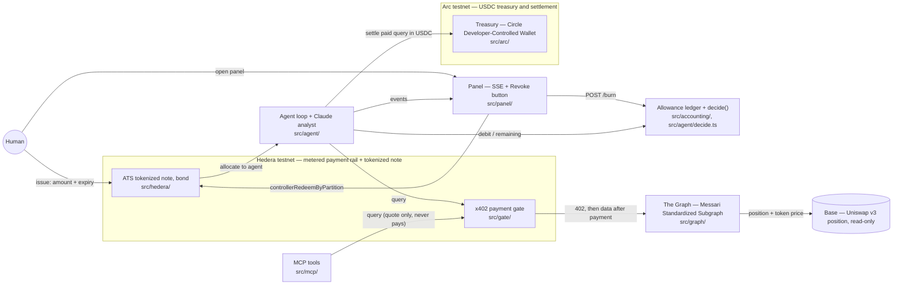

# Architecture

Allowance watches a real Uniswap v3 position on Base and warns if it deteriorates. It never
holds a blank-check wallet: it spends from a bounded, expiring, revocable allowance, and it
stops by itself when that allowance runs out.

Seven components, one human, one panel, and two clearly separated chain boundaries: **Hedera
testnet** is the metered payment rail and the tokenized note; **Arc testnet** is the USDC
treasury where the paid queries settle. Base is not a wallet boundary here — it is the chain the
watched position lives on, read only through The Graph.

## Components

**Allowance ledger + decide()** — `src/accounting/`, `src/agent/decide.ts`. The spending brain,
entirely off-chain and in integer microUSDC. `note.ts` tracks an amount, a spent counter, an
expiry, and a burned flag, and only ever moves money by `debit()`, which rejects a payment that
would exceed what is left, that arrives after expiry, or that targets a burned note. `decide.ts`
is the deterministic rule that decides whether a query is worth paying for: pay only if the
price fits inside the remaining budget and the cached answer is stale enough to be worth
refreshing. This function is the only place spending is decided — nothing downstream of it,
including the Claude analyst, can trigger a payment.

**Agent loop + Claude analyst** — `src/agent/`. `run.ts` drives the loop: for every tool in the
catalog it asks `decide()`, checks the debit before paying and commits it only once the payment
succeeded — never before, and never for a payment that failed or came back with a non-2xx status
— then settles on Arc, and stops the instant a debit fails because the note is exhausted,
expired, or burned. After any round that bought at least one fresh fact, it calls the analyst
(`analyst.ts`, model `claude-opus-5`) with the paid facts only; the analyst reads and summarizes,
it never spends. Its refusal or failure never stops the loop or debits anything. `live.ts` wires
the loop to the real Hedera payment client, the real Arc settlement, and the real Anthropic
client; `main.ts` is the process entry point — it does not read `.env` itself, the `npm run
agent` script loads it first (`tsx --env-file=.env`) — that issues the note, starts the panel,
and runs the loop.

**MCP tools** — `src/mcp/`. A paywalled *facade*, not a second way to pay: it exposes the same two
priced tools (`token_price`, `position_state`) over the Model Context Protocol — each tool's
description already states its price in USDC — but every call still goes through the same
paywalled gate route, and on a 402 the server hands that 402 back to the MCP client as the tool's
result instead of paying it. The MCP server itself never signs or sends a payment; the only code
path that ever pays is `src/gate/pay.ts` (used by the agent loop via `src/agent/live.ts`). An MCP
client gets the quote, never the data, unless something else pays on its behalf.

**x402 payment gate** — `src/gate/`. An HTTP service built on the official `@x402/hono`
middleware. Every tool call is a paywalled route: no payment, no data. `pay.ts` is the paying
side — it signs and sends a real USDC transfer on Hedera testnet and never proceeds if the gate
quotes a different amount than what was authorized for that call.

**The Graph — Messari Standardized Subgraph** — `src/graph/`. `client.ts` queries a single
Messari Standardized Subgraph (DEX AMM Extended schema) for Uniswap v3 on Base — one query shape
returns both position state and token USD price, with no separate Token API. `tools.ts` prices
each of those queries and hands them to the gate and to the MCP server.

**ATS tokenized note (bond)** — `src/hedera/`. The allowance itself, tokenized as a bond through
Hedera's Asset Tokenization Studio contracts (factory `0.0.9213391`, resolver `0.0.9212226`).
`issueNoteOnChain` deploys the bond and issues it to the agent's address; `burnNoteOnChain` calls
`controllerRedeemByPartition` to revoke. The on-chain token represents the authorization that was
issued; per-query spending is tracked off-chain in the ledger, so revoking burns whatever balance
is still unspent at that moment.

**Arc treasury — Circle Developer-Controlled Wallet** — `src/arc/`. `treasury.ts` settles every
paid query in USDC on Arc testnet from a Circle Developer-Controlled Wallet, with an idempotency
key derived deterministically from the payment reference (`amount.ts` handles the microUSDC-to-
decimal conversion Circle's API expects), so retrying a settlement can never pay twice. Arc
mainnet does not exist yet; the chain id and RPC URL are both configurable via environment
variables.

**Panel** — `src/panel/`. A live view over Server-Sent Events showing the note's remaining
balance, every considered/paid/refused query, and the analyst's alerts, plus a Revoke button that
burns the note in the ledger immediately and, if the note was issued on-chain, also fires the ATS
burn asynchronously.

**Human** — issues the allowance (amount and expiry) before the agent starts, watches the panel,
and can revoke at any time. Revoking is the only way the agent is stopped from outside; otherwise
it stops itself when the note runs out.

## Two rails, one payment

Every paid query moves USDC twice — once on Hedera, once on Arc — and it is easy to read that as
double-spending. It is not; they are two legs of the same payment, settling two different
obligations:

1. **Hedera — the data vendor is paid once**, from the agent's own float (its Hedera USDC
   balance), capped by the allowance. This is the x402 payment itself (`src/gate/pay.ts`).
2. **Arc — the treasury reimburses that float once**, to whoever owns it (`ARC_OPERATOR_ADDRESS`),
   keyed by the Hedera payment's transaction id (`idempotencyKeyFromRef` in `src/arc/treasury.ts`)
   so retrying a settlement can never reimburse the same payment twice.

In the demo every account belongs to the same operator, so HashScan and Arcscan both show the
same amount moving for the same query — which can look redundant on screen. It is not a second
purchase: the Arc leg reimburses the float that fronted the Hedera payment, it does not buy the
data a second time. In a deployment where the float owner and the data vendor are different
parties, this is what makes fronting the Hedera payment sustainable for whoever holds the float.

## Prototype trust boundary

In this prototype, the settlement leg (Circle credentials, read inside `liveSettleDeps` in
`src/arc/treasury.ts`) and the issue/burn leg (the ATS issuer key, read inside `liveAtsDeps` in
`src/hedera/ats.ts`) run in the same process as the agent loop, for simplicity — all three
credential sets end up available wherever `src/agent/main.ts` runs.

In production these two legs belong in a separate treasury/operator service that watches the
gate's settled payments (rather than being invoked in-line by the same loop that spends) and
reacts to them from its own process, with its own credentials. The agent itself should hold only
its Hedera float key — enough to pay the gate — never the Circle credentials or the ATS issuer
key. This document only describes where that boundary should sit next; no code moved to
implement it in this prototype.
