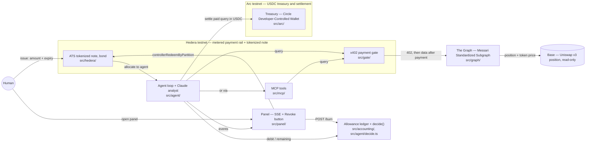

# Architecture

Allowance watches a real Uniswap v3 position on Base and warns if it deteriorates. It never
holds a blank-check wallet: it spends from a bounded, expiring, revocable allowance, and it
stops by itself when that allowance runs out.

Seven components, one human, one panel, and two clearly separated chain boundaries: **Hedera
testnet** is the metered payment rail and the tokenized note; **Arc testnet** is the USDC
treasury where the paid queries settle. Base is not a wallet boundary here — it is the chain the
watched position lives on, read only through The Graph.

## Components

**Allowance ledger + decide()** — `src/accounting/`, `src/agent/decide.ts`. The spending brain,
entirely off-chain and in integer microUSDC. `note.ts` tracks an amount, a spent counter, an
expiry, and a burned flag, and only ever moves money by `debit()`, which rejects a payment that
would exceed what is left, that arrives after expiry, or that targets a burned note. `decide.ts`
is the deterministic rule that decides whether a query is worth paying for: pay only if the
price fits inside the remaining budget and the cached answer is stale enough to be worth
refreshing. This function is the only place spending is decided — nothing downstream of it,
including the Claude analyst, can trigger a payment.

**Agent loop + Claude analyst** — `src/agent/`. `run.ts` drives the loop: for every tool in the
catalog it asks `decide()`, debits the ledger before paying (never after), pays, settles on Arc,
and stops the instant a debit fails because the note is exhausted, expired, or burned. After any
round that bought at least one fresh fact, it calls the analyst (`analyst.ts`, model
`claude-opus-5`) with the paid facts only; the analyst reads and summarizes, it never spends. Its
refusal or failure never stops the loop or debits anything. `live.ts` wires the loop to the real
Hedera payment client, the real Arc settlement, and the real Anthropic client; `main.ts` is the
process entry point that reads `.env`, issues the note, starts the panel, and runs the loop.

**MCP tools** — `src/mcp/`. Exposes the same two priced tools (`token_price`, `position_state`)
over the Model Context Protocol, so any MCP-aware assistant can call them the same way the agent
does — each call still goes through the x402 gate and still needs payment.

**x402 payment gate** — `src/gate/`. An HTTP service built on the official `@x402/hono`
middleware. Every tool call is a paywalled route: no payment, no data. `pay.ts` is the paying
side — it signs and sends a real USDC transfer on Hedera testnet and never proceeds if the gate
quotes a different amount than what was authorized for that call.

**The Graph — Messari Standardized Subgraph** — `src/graph/`. `client.ts` queries a single
Messari Standardized Subgraph (DEX AMM Extended schema) for Uniswap v3 on Base — one query shape
returns both position state and token USD price, with no separate Token API. `tools.ts` prices
each of those queries and hands them to the gate and to the MCP server.

**ATS tokenized note (bond)** — `src/hedera/`. The allowance itself, tokenized as a bond through
Hedera's Asset Tokenization Studio contracts (factory `0.0.9213391`, resolver `0.0.9212226`).
`issueNoteOnChain` deploys the bond and issues it to the agent's address; `burnNoteOnChain` calls
`controllerRedeemByPartition` to revoke. The on-chain token represents the authorization that was
issued; per-query spending is tracked off-chain in the ledger, so revoking burns whatever balance
is still unspent at that moment.

**Arc treasury — Circle Developer-Controlled Wallet** — `src/arc/`. `treasury.ts` settles every
paid query in USDC on Arc testnet from a Circle Developer-Controlled Wallet, with an idempotency
key derived deterministically from the payment reference (`amount.ts` handles the microUSDC-to-
decimal conversion Circle's API expects), so retrying a settlement can never pay twice. Arc
mainnet does not exist yet; the chain id and RPC URL are both configurable via environment
variables.

**Panel** — `src/panel/`. A live view over Server-Sent Events showing the note's remaining
balance, every considered/paid/refused query, and the analyst's alerts, plus a Revoke button that
burns the note in the ledger immediately and, if the note was issued on-chain, also fires the ATS
burn asynchronously.

**Human** — issues the allowance (amount and expiry) before the agent starts, watches the panel,
and can revoke at any time. Revoking is the only way the agent is stopped from outside; otherwise
it stops itself when the note runs out.
